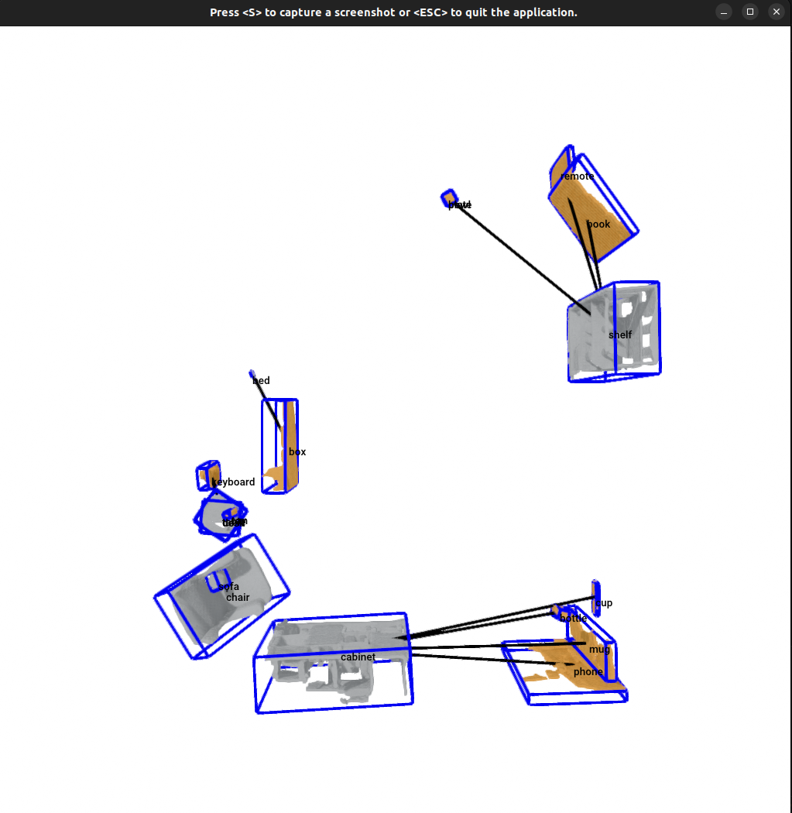

# HSR-C OVMM — Scene Graphs, Navigation & Open-Vocabulary Search

Open-vocabulary 3D scene understanding and mobile manipulation (OVMM) for the
Toyota HSR-C robot, developed and tested in Gazebo (Ignition Fortress) using
the `apartment.world` simulation. A real-RGBD-scan pipeline (Mask3D) is also
included for running the same scene graph on physical scans.

---

## Scene Graph Output



*Movable objects (fruit, cans, wallet, ...) connected to their nearest
immovable anchor (table, shelf, cabinet, ...) with spatial edges. Visualized
with Open3D.*

---

## Table of Contents

1. [Prerequisites](#1-prerequisites)
2. [Project Setup](#2-project-setup)
3. [Running the Dev Container](#3-running-the-dev-container)
4. [Building the ROS 2 Workspace](#4-building-the-ros-2-workspace)
5. [Gazebo Simulation & Navigation](#5-gazebo-simulation--navigation)
6. [Scene Graph from Simulation Ground Truth](#6-scene-graph-from-simulation-ground-truth)
7. [Scene Graph from a Real RGB-D Scan (Mask3D)](#7-scene-graph-from-a-real-rgb-d-scan-mask3d)
8. [Open-Vocabulary Scene Reasoning (DeepSeek)](#8-open-vocabulary-scene-reasoning-deepseek)
9. [Object Detection Server (SAM3)](#9-object-detection-server-sam3)
10. [Demo: Single-Command Search & Fetch](#10-demo-single-command-search--fetch)

---

## 1. Prerequisites

On the **host machine**, install:

- [Docker](https://docs.docker.com/get-docker/) with NVIDIA Container Toolkit (`nvidia-docker2`)
- [VS Code](https://code.visualstudio.com/) with the [Dev Containers extension](https://marketplace.visualstudio.com/items?itemName=ms-vscode-remote.remote-containers)
- NVIDIA GPU with CUDA support

Allow Docker to access the X display (run once per session on the host):

```bash
xhost +local:docker
```

---

## 2. Project Setup

Clone this repository:

```bash
git clone <repo-url> /home/ws
cd /home/ws
```

Repo structure relevant to the pipeline:

```
/home/ws/
├── core/
│   ├── perception/
│   │   ├── scene_graph/      # SceneGraph, ObjectNode, DrawerNode, builders,
│   │   │                      # gazebo_geometry (reads sizes from Gazebo SDF)
│   │   ├── segmentation/      # Mask3D output loader
│   │   └── detection/         # SAM3 REST client
│   ├── llm_zone/               # DeepSeek room clustering + scene queries
│   ├── missions/                # search_and_fetch mission runner
│   └── utils/                    # ScanNet200 label tables
├── docker/
│   ├── mask3d/                   # Mask3D setup + run scripts (host)
│   └── sam3/                      # SAM3 detection server (host)
├── ros2_ws/src/fetcher/           # ROS 2 nodes (Nav2 goals, scene graph, seeker)
├── docs/report/                    # scene_graph_report.tex/pdf -- methodology
│                                    # and demo-day code correlation
├── configs/config.yaml            # paths + model server endpoints
├── images/sg.png                  # example scene graph output
└── .devcontainer/                 # VS Code dev container config
```

The following directories are **not tracked** in git and must exist on the
host before opening the container:

| Host path | Mounted inside container at |
|---|---|
| your built HSR ROS 2 workspace | `/home/ws/ros2_ws` |
| RGB-D scan data (only needed for §7) | `/home/ws/data` |

> **Before opening the container**, edit `.devcontainer/devcontainer.json` and
> update the `mounts` section to point to your local paths:
>
> ```json
> "mounts": [
>     "source=/home/comrade/hsr_ros2_ws,target=/home/ws/ros2_ws,type=bind,consistency=cached",
>     "source=/home/comrade/Desktop/data_hrl,target=/home/ws/data,type=bind,consistency=cached"
> ]
> ```

---

## 3. Running the Dev Container

1. Open the `/home/ws` folder in VS Code.
2. When prompted, click **Reopen in Container** — or open the Command Palette
   (`Ctrl+Shift+P`) and run `Dev Containers: Reopen in Container`.
3. VS Code builds the image (first time only, ~5–10 min) and starts the
   container.

The container automatically:
- Sources `/opt/ros/humble/setup.bash` and `/home/ws/ros2_ws/install/setup.bash`
- Adds `/home/ws` to `PYTHONPATH` (so `core.*` is importable from anywhere)
- Installs Python deps for the pure-Python core: `open3d`, `scipy`,
  `scikit-learn`, `pandas`, `openai`, `graphviz`, `requests`,
  `opencv-python`, `transforms3d`, `pyyaml`, `numpy<1.25`
- Installs ROS 2 system deps: `nav2-bringup`, `nav2-simple-commander`,
  `tf-transformations`, `gazebo-ros-pkgs`, `control-msgs`, `navigation2`
- Runs `rosdep install` for `ros2_ws/src` (once, tracked by `.rosdep_installed`)

To open a terminal inside the running container, use the VS Code integrated
terminal.

---

## 4. Building the ROS 2 Workspace

```bash
cd /home/ws/ros2_ws
colcon build --symlink-install
source install/setup.bash
```

This builds the `fetcher` package (the project's ROS 2 nodes) along with the
mounted HSR-C workspace packages.

---

## 5. Gazebo Simulation & Navigation

Launch Gazebo with the HSR-C robot in the apartment world (includes all
furniture and objects — `apartment.world`, world name `default`):

```bash
ros2 launch hsrb_gazebo_launch hsrc_apartment_world.launch.py
```

Bring up Nav2 with the included map (`map.yaml` / `map.pgm` at the repo root):

```bash
ros2 launch hsrb_rosnav_config navigation_launch.py map:=/home/ws/map.yaml
```

### Simple Nav2 goal demo

```bash
ros2 run fetcher good_boy
```

Sets an initial pose at the origin, waits for Nav2 to become active, and
drives to a hardcoded goal `(2.0, 1.0)`.

---

## 6. Scene Graph from Simulation Ground Truth

The simplest and currently primary scene graph builder. Instead of running
any perception pipeline, it reads every object's name and pose straight from
`apartment.world.xacro` (the simulation's ground truth), and reads each
object's *size and shape* by parsing that object's own `model.sdf` collision
geometry via `core/perception/scene_graph/gazebo_geometry.py` (box, cylinder,
sphere, or mesh, including COLLADA unit correction). Nothing about an
object's dimensions is hand-picked -- it feeds synthesized point clouds
through the same `SceneGraph` / `ObjectNode` pipeline used for real scans.

See [`docs/report/scene_graph_report.pdf`](docs/report/scene_graph_report.pdf)
for a detailed write-up of this geometry-extraction pipeline (with diagrams),
plus a full code-correlation walkthrough of every demo-day requirement.

```bash
ros2 run fetcher gazebo_scene_graph
# or, equivalently, without ROS:
python -m core.perception.scene_graph.build_scene_graph_gazebo [--visualize]
```

This prints all 24 objects (16 furniture + 8 movable items) with their
centroids/dimensions, computes spatial edges (movable → nearest furniture),
and writes:

- `data/scene_graph/graph.json` — node ids/labels, immovable ids, connections
- `data/scene_graph/scene.json` — furniture `{id: {label, centroid, dimensions}}`
- `data/scene_graph/objects/{id}.json` — one file per movable object

`--visualize` opens an Open3D window with labels, centroids and connection
edges.

---

## 7. Scene Graph from a Real RGB-D Scan (Mask3D)

For a physical scan (`scene.ply` in `$HRL_DATA_DIR`, default `/home/ws/data`),
run Mask3D segmentation **on the host**, then build the scene graph **inside
the dev container**.

### One-time setup (host)

```bash
bash docker/mask3d/setup_mask3d.sh
```

Clones the Mask3D fork into `models/Mask3D` and downloads the ScanNet200
checkpoint.

### Per-scan (host)

```bash
bash docker/mask3d/run_mask3d.sh [workspace] [mask3d_repo]
```

Produces `predictions.txt`, `pred_mask/`, `mesh_labeled.ply` in the workspace.

### Build the scene graph (dev container)

```bash
python -m core.perception.scene_graph.build_scene_graph [--workspace <path>] [--visualize]
```

Writes the same `graph.json` / `scene.json` / `objects/*.json` outputs as §6.

---

## 8. Open-Vocabulary Scene Reasoning (DeepSeek)

Both scripts read the scene graph JSONs from `$HRL_DATA_DIR/scene_graph` and
require `DEEPSEEK_API_KEY` (free key at https://platform.deepseek.com).

### Room clustering

```bash
DEEPSEEK_API_KEY=<key> python -m core.llm_zone.room_clustering
```

Clusters furniture into rooms (kitchen, living room, ...) using semantics +
spatial proximity, and writes `data/scene_graph/rooms.json`.

### Scene query

```bash
DEEPSEEK_API_KEY=<key> python core/llm_zone/scene_query.py "something to drink"
```

Returns the best-matching object/furniture (id, label, type, map-frame
centroid). If the target isn't in the scene graph, also predicts the top-3
furniture locations most likely to have it.

---

## 9. Object Detection Server (SAM3)

SAM3 needs Python ≥ 3.12 / PyTorch ≥ 2.7 / CUDA ≥ 12.6, so it runs in its own
container on the **host**, separate from the ROS 2 Humble (Python 3.10) dev
container.

```bash
export HF_TOKEN=hf_xxx   # accept the facebook/sam3 license on Hugging Face first
bash docker/sam3/run_sam3.sh
```

Serves `http://localhost:5005/sam3/predict`. From the dev container:

```python
from core.perception.detection.sam3_client import Sam3Client
client = Sam3Client()
det = client.detect(rgb_image, "red cup")
```

---

## 10. Demo: Single-Command Search & Fetch

`core/missions/search_and_fetch.py` is the ROS-agnostic mission runner for
demo steps 3-7 (predict location → navigate → look at it with the head
camera → detect with SAM3 → build a point cloud → grasp). The ROS 2 side is
`ros2_ws/src/fetcher/fetcher/robot_adapter.py` (`HsrRobotAdapter`), wired up
by `search_and_fetch_node.py`.

### Pre-started stack

1. Gazebo + Nav2 (see §5):

   ```bash
   ros2 launch hsrb_gazebo_launch hsrc_apartment_world.launch.py
   ros2 launch hsrb_rosnav_config navigation_launch.py map:=/home/ws/map.yaml
   ```

2. SAM3 detection server (see §9, on the host):

   ```bash
   bash docker/sam3/run_sam3.sh
   ```

3. HSR IK solver, used by `grasp()`:

   ```bash
   ros2 launch fetcher ik_solver.launch.py
   ```

### Build the scene graph + room clusters (once per scene)

```bash
ros2 run fetcher gazebo_scene_graph                              # step 1
DEEPSEEK_API_KEY=<key> python -m core.llm_zone.room_clustering   # step 2
```

### Run the mission (steps 3-7, single command)

```bash
DEEPSEEK_API_KEY=<key> ros2 run fetcher search_and_fetch "<object>"
```

- **Scenario A** (object not in the scene graph): queries the LLM for the
  top-k furniture locations most likely to have it, then tries each in turn.
- **Scenario B** (object already in the scene graph): navigates straight to
  its known location; if not found there, falls back to the LLM prediction.
- At each candidate location the robot navigates, pans/tilts its head to
  look at the target (`HsrRobotAdapter.look_at`, active perception via
  `core/llm_zone/active_perception.py`), and runs SAM3 detection. On a hit
  it builds an RGB-D point cloud of the object and calls `grasp()` (top-down
  grasp via `ik_solver_node` + the arm/gripper trajectory controllers).

Prints a final `MissionResult(found, grasped, location_label, tried)`.

- `ros2_ws/src/fetcher/fetcher/seeker.py` — earlier YOLO + DeepSeek based
  search-and-approach demo (`ros2 run fetcher seeker "<query>"`). Requires
  `ultralytics` (not yet in the dev container image) and a running Nav2.
